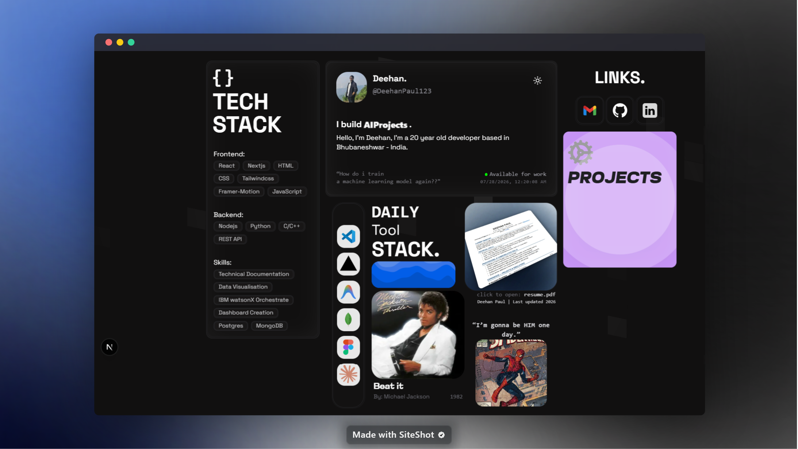

# Minimal Bento Portfolio

A minimal, pixel-perfect personal portfolio website for **Deehan Paul** showcasing work as a full-stack developer.



## Overview

This is a modern, animated Next.js portfolio featuring a bento-style home grid, an
Apple-style projects carousel, light/dark themes, Framer Motion animations, and
rich SEO metadata.

**About Deehan Paul:** 20 year-old developer based in Bhubaneshwar, India.

### Tech Stack

- **Next.js 16** (App Router + Turbopack)
- **React 19**
- **TypeScript**
- **Tailwind CSS v3** (with `tailwind-merge`, `tailwindcss-animate`)
- **Framer Motion** for animations & micro-interactions
- **shadcn/ui pattern** (CVA, Radix UI primitives, custom components under `components/ui/`)
- **next-themes** — Light / Dark mode toggle
- **Lucide React** & **Tabler Icons** — Icon libraries
- **@vercel/analytics** — Privacy-friendly analytics
- **Magic UI** — Bento grid, animated grid pattern, ripple, flickering grid, typing animation helpers

### Features

- Home page with a Bento grid (profile, tech stack, links, projects preview, music track, resume, tools, waveforms)
- Dedicated `/projects` route with an Apple-style cards carousel (clickable projects + GitHub links)
- Light / Dark theme with persisted preference (localStorage)
- Framer Motion entrance and hover animations throughout
- SEO & metadata configured for Deehan Paul 
- PWA-ready (web manifest + complete favicon set under `public/favicon/`)
- Privacy-friendly Vercel Analytics
- Clickable resume card linking to `/resume.pdf`

---

## Development

### Prerequisites

Ensure you have the following installed:

- [Node.js](https://nodejs.org/) (Latest LTS recommended — the project ships with Next 16 + React 19)
- [pnpm](https://pnpm.io/), [npm](https://www.npmjs.com/) or any compatible package manager
- [Git](https://git-scm.com/)

### Setup

#### 1. Clone the repository

```bash
git clone https://github.com/DeehanPaul123/<your-repo>.git
cd <your-repo>
```

#### 2. Install dependencies

```bash
pnpm install
# or
npm install
```

#### 3. Environment variables

This project does not require any environment variables out of the box.

If you later add integrations that need secrets (e.g. analytics IDs, custom
API keys), create a `.env.local` file at the repo root and add them there.
Next.js will pick them up automatically.

#### 4. Run the development server

```bash
pnpm dev
# or
npm run dev
```

The application will be available at **[http://localhost:3000](http://localhost:3000)**.

### Building for Production

```bash
pnpm build
# or
npm run build
```

Then start the production server with:

```bash
pnpm start
# or
npm run start
```

### Scripts

| Script | Description |
| ------ | ----------- |
| `pnpm dev` / `npm run dev` | Start the Next.js dev server (Turbopack) |
| `pnpm build` / `npm run build` | Create an optimized production build |
| `pnpm start` / `npm run start` | Start the production Next.js server |
| `pnpm lint` / `npm run lint` | Run ESLint across the project |

---

## License

Licensed under the **MIT License** — see [`LICENSE`](./LICENSE).

You're free to use this code! If you do, please **remove all of Deehan Paul's personal information** before publishing your own version (name, social handles, profile images, resume.pdf, project content, custom domain, analytics). Enjoy — it's awesome to see this code being useful!

---

## Contributing

Thank you for your interest in contributing!

### How to Contribute

#### Reporting bugs or suggesting features
- Open a **GitHub Issue** on this repository
- Use a clear, descriptive title + include steps to reproduce (for bugs) or concrete use cases (for features)

#### Submitting changes

1. **Fork** the repository and clone your fork locally.
2. **Setup** — see [Development](#development) above for prerequisites and install steps.
3. Create a branch from `main` (e.g. `git checkout -b fix/typo-readme`).
4. Make your changes and ensure `pnpm lint` (or `npm run lint`) passes.
5. Commit with a clear message (e.g. `fix: correct link in footer`).
6. Push to your fork and open a **Pull Request** against `main`.
7. In the PR description: explain what changed, why, and link any related issues.

### Code of Conduct

This project follows the **Contributor Covenant, version 2.0**
(included in a shortened form below). By participating, you are expected to
uphold this standard.

---

## Acknowledgments

Open-source libraries and tools that make this portfolio possible:

- [React](https://react.dev)
- [Next.js](https://nextjs.org)
- [Tailwind CSS](https://tailwindcss.com)
- [Framer Motion](https://www.framer.com/motion)
- [Radix UI](https://www.radix-ui.com)
- [Lucide Icons](https://lucide.dev)
- [Tabler Icons](https://tabler.io/icons)
- [next-themes](https://github.com/pacocoursey/next-themes)
- [Vercel Analytics](https://vercel.com/analytics)
- Magic UI pattern components
- And other open-source dependencies listed in `package.json`
